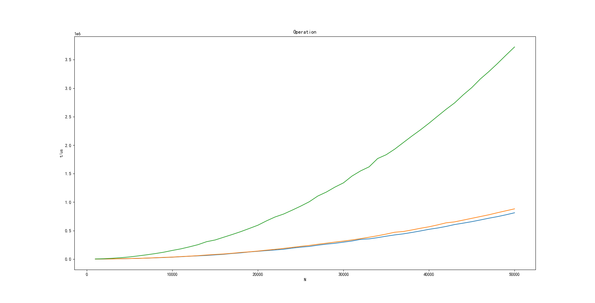
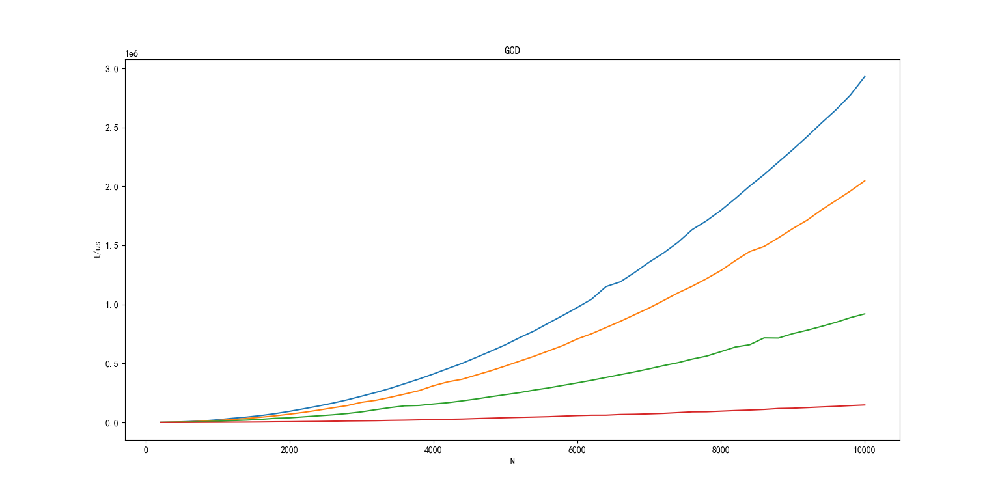

# 对各类算法实际运行速度的研究

[](https://badges.toozhao.com/stats/01HYYWYQBB14JMAN1FF6XZGFMW) 

项目所用计时函数如下：

```cpp
double get_runtime(const int N) {
  LARGE_INTEGER StartingTime, EndingTime;
  LARGE_INTEGER Frequency;
  QueryPerformanceFrequency(&Frequency);
  QueryPerformanceCounter(&StartingTime);
  sum += func(N);
  QueryPerformanceCounter(&EndingTime);
  return 1e6 * (EndingTime.QuadPart - StartingTime.QuadPart) /
         Frequency.QuadPart;
}
```

如无说明，计时程序运行时开启 O2 优化，我会对程序做调整，保证编译器不将运算过程视为死代码块。

## 基本运算

核心运算如下：

```cpp
unsigned func(const int N) {
  unsigned r = 0;
  for (int i = 1; i <= N; ++i)
    for (int j = 1; j <= N; ++j)
      r += oper(i, j);
  return r;
}
```

按用时升序排列：
1. 加法（与减法同级）
2. 乘法
3. 除法（与取模同级）



## GCD

核心运算如下：

```cpp
unsigned func(const int N) {
  unsigned r = 0;
  for (int i = 1; i <= N; ++i)
    for (int j = 1; j <= N; ++j)
      r += gcd(i, j);
  return r;
}
```

我们对四种算法的运行时间进行了对比（按运行时间降序）：
1. 欧几里得算法；
2. 更相减损法（带优化）；
3. 基于值域预处理的快速 GCD （不计预处理）；
4. 取模（不是 GCD 算法，用于对照）。


